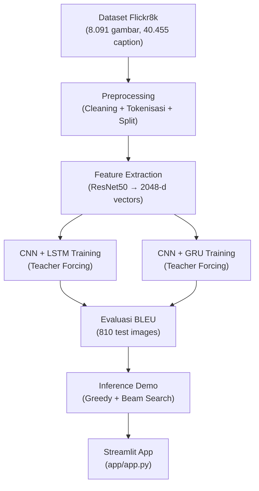
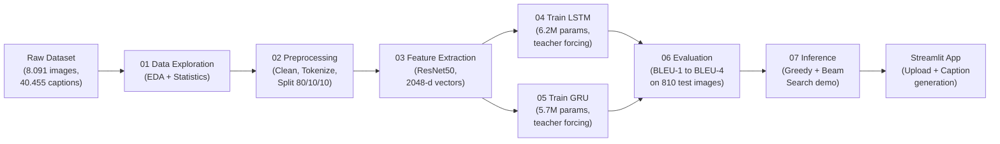

# Dokumentasi Proyek — Image Captioning dengan CNN + LSTM / GRU

---

## Daftar Isi

1. [Pendahuluan](#1-pendahuluan)
2. [Gambaran Besar Proyek](#2-gambaran-besar-proyek)
3. [Struktur Folder Proyek](#3-struktur-folder-proyek)
4. [Penjelasan Notebook](#4-penjelasan-notebook)
5. [Penjelasan Source Code](#5-penjelasan-source-code)
6. [Penjelasan Dataset](#6-penjelasan-dataset)
7. [Tahapan Preprocessing](#7-tahapan-preprocessing)
8. [Feature Extraction](#8-feature-extraction)
9. [Model Training](#9-model-training)
10. [Evaluasi Model](#10-evaluasi-model)
11. [Inference](#11-inference)
12. [Deployment](#12-deployment)
13. [Alur End-to-End](#13-alur-end-to-end)
14. [Kesimpulan](#14-kesimpulan)

---

## 1. Pendahuluan

### Latar Belakang

Image captioning adalah tugas yang menghubungkan Computer Vision dan Natural Language Processing, di mana sebuah model harus mampu memahami isi gambar secara visual kemudian menghasilkan deskripsi tekstual yang alami dan bermakna. Proyek ini dibuat sebagai tugas akhir mata kuliah Pembelajaran Mesin.

### Tujuan Proyek

- Membangun sistem yang dapat menghasilkan caption otomatis dari gambar menggunakan arsitektur CNN encoder + RNN decoder.
- Mengimplementasikan dua model: **CNN-LSTM** sebagai model utama dan **CNN-GRU** sebagai model baseline.
- Membandingkan performa kedua model menggunakan metrik BLEU Score.
- Menyediakan antarmuka web berbasis Streamlit untuk demonstrasi caption generation secara interaktif.

### Output Akhir

- Dua model terlatih dalam format `.keras` (LSTM dan GRU).
- BLEU score untuk keempat varian (BLEU-1 hingga BLEU-4) pada kedua model.
- Notebook interaktif untuk eksplorasi, training, evaluasi, dan inference.
- Aplikasi web Streamlit yang menerima upload gambar dan menampilkan caption hasil prediksi.

---

## 2. Gambaran Besar Proyek

Alur data dari input hingga output:



Penjelasan alur:

1. **Dataset** — Flickr8k berisi 8.091 gambar dengan 5 caption per gambar.
2. **Preprocessing** — Caption dibersihkan (lowercase, hapus noise), ditambahkan token `<start>` dan `<end>`, di-tokenize menjadi integer sequences, dan dataset di-split menjadi train/val/test.
3. **Feature Extraction** — Setiap gambar diproses oleh ResNet50 (pre-trained ImageNet) tanpa classification head, menghasilkan vektor 2048 dimensi per gambar.
4. **Training** — Dua model dilatih secara independen dengan pipeline data yang identik. LSTM menerima initial state (h dan c) dari proyeksi fitur gambar. GRU menerima initial state tunggal (h) dari proyeksi yang sama.
5. **Evaluasi** — Kedua model dijalankan pada 810 gambar test set. Caption hasil prediksi dibandingkan dengan 5 ground-truth caption menggunakan BLEU-1 hingga BLEU-4.
6. **Inference** — Notebook demo untuk mencoba model pada gambar dataset maupun gambar kustom, dengan opsi greedy decoding maupun beam search.
7. **Deployment** — Aplikasi Streamlit yang memungkinkan pengguna mengunggah gambar dan mendapatkan caption secara interaktif.

---

## 3. Struktur Folder Proyek

```
ml-image-captioning/
├── dataset/
│   ├── captions.txt          # File CSV berisi 40.455 pasangan (image, caption)
│   └── Images/               # Folder berisi 8.091 file JPEG
├── notebooks/
│   ├── 01_data_exploration.ipynb     # Eksplorasi dan visualisasi dataset
│   ├── 02_preprocessing.ipynb        # Preprocessing caption + tokenizer + split
│   ├── 03_feature_extraction.ipynb   # Ekstraksi fitur dengan ResNet50
│   ├── 04_train_lstm.ipynb           # Training CNN + LSTM
│   ├── 05_train_gru.ipynb            # Training CNN + GRU (baseline)
│   ├── 06_evaluation.ipynb           # Evaluasi BLEU LSTM vs GRU
│   └── 07_inference.ipynb            # Demo inference (greedy + beam search)
├── src/
│   ├── config.py                     # Konfigurasi terpusat (path, hyperparameter)
│   ├── preprocess/
│   │   ├── caption_cleaner.py        # Fungsi pembersihan teks caption
│   │   └── tokenizer.py              # Build/save/load tokenizer
│   ├── feature/
│   │   └── extractor.py              # Ekstraktor fitur berbasis ResNet50
│   ├── models/
│   │   ├── attention.py              # Layer Bahdanau Attention
│   │   ├── lstm_model.py             # Arsitektur model CNN+LSTM+Attention
│   │   └── gru_model.py              # Arsitektur model CNN+GRU
│   └── evaluation/
│       └── metrics.py                # Perhitungan BLEU Score
├── app/
│   └── app.py                        # Aplikasi Streamlit
├── model/
│   ├── features.pkl                  # 8.091 vektor fitur 2048-d (64 MB)
│   └── tokenizer.pkl                 # Tokenizer tersimpan (312 KB)
├── outputs/
│   ├── captions_clean.csv            # Caption setelah cleaning
│   ├── split_info.pkl                # Informasi split train/val/test
│   ├── training/
│   │   ├── lstm/                     # Checkpoint, history, plot LSTM
│   │   └── gru/                      # Checkpoint, history, plot GRU
│   └── evaluation/
│       ├── bleu_scores.csv           # Skor BLEU kedua model
│       ├── bleu_comparison.png       # Bar chart perbandingan BLEU
│       └── predictions.csv           # Prediksi lengkap test set
├── README.md                         # Dokumentasi singkat proyek
├── requirements.txt                  # Dependensi pip
├── environment.yml                   # Spesifikasi Conda environment
├── GPU_SETUP.md                      # Panduan konfigurasi GPU
├── PROJECT_DOCUMENTATION.md          # Dokumentasi ini
└── LICENSE                           # Lisensi MIT
```

### Penjelasan Folder

| Folder | Fungsi |
|--------|--------|
| `dataset/` | Menyimpan data mentah: gambar JPEG dan file caption CSV. Folder ini tidak dimodifikasi oleh kode apa pun. |
| `notebooks/` | Berisi 7 notebook Jupyter yang membentuk pipeline lengkap. Setiap notebook memiliki tujuan spesifik dan menghasilkan output yang digunakan oleh notebook berikutnya. |
| `src/` | Modul Python yang berisi fungsi-fungsi reusable, dipisahkan berdasarkan fungsionalitas: preprocessing, feature extraction, model architectures, dan evaluasi. |
| `app/` | Berisi aplikasi Streamlit untuk deployment. |
| `model/` | Tempat penyimpanan artifacts yang dihasilkan oleh pipeline: feature vectors hasil ekstraksi CNN dan tokenizer yang sudah di-fit. |
| `outputs/` | Seluruh output dari pipeline yang sudah dijalankan: caption yang sudah dibersihkan, split info, model weights (.keras), training history, plot, dan hasil evaluasi. |

---

## 4. Penjelasan Notebook

### 4.1 `01_data_exploration.ipynb`

**Tujuan:** Memahami karakteristik dataset sebelum preprocessing dan training.

**Input:**
- `dataset/captions.txt` — 40.455 baris caption
- `dataset/Images/` — 8.091 gambar JPEG

**Output:** Tidak ada file output. Notebook ini hanya bersifat eksploratif.

**Penjelasan:**

Notebook ini melakukan eksplorasi data awal (Exploratory Data Analysis / EDA) yang mencakup:

1. **Memuat dataset** — Membaca file CSV dengan pandas. Menampilkan 5 baris pertama untuk memahami struktur data (kolom `image` dan `caption`).
2. **Memeriksa kualitas data** — Mengecek missing values (0), duplikasi (10 baris duplikat, yang diabaikan), dan jumlah gambar unik (8.091).
3. **Distribusi caption per gambar** — Setiap gambar memiliki tepat 5 caption. Ini adalah format standar Flickr8k.
4. **Statistik panjang caption** — Rata-rata caption memiliki ~11 kata, dengan maksimum ~38 kata sebelum cleaning. Berdasarkan distribusi ini, `MAX_CAPTION_LEN=34` ditetapkan untuk menampung hampir seluruh caption.
5. **Analisis vocabulary** — Total 476.665 kata dari seluruh caption dengan 8.918 kata unik. Top 20 kata yang paling sering muncul divisualisasikan dengan bar chart.
6. **Visualisasi sampel** — 3 gambar acak ditampilkan bersama 5 caption masing-masing, untuk memberikan gambaran visual tentang data.

**Kesimpulan:**
- Dataset bersih tanpa missing values.
- Setiap gambar memiliki 5 caption.
- `MAX_CAPTION_LEN = 34` dan `VOCAB_SIZE = 5000` adalah konfigurasi yang sesuai.
- Tidak ada anomali yang memerlukan penanganan khusus.

**Hubungan dengan notebook berikutnya:** Hasil eksplorasi digunakan untuk menentukan parameter preprocessing pada notebook 02.

---

### 4.2 `02_preprocessing.ipynb`

**Tujuan:** Membersihkan teks caption, membangun vocabulary, mengonversi caption ke integer sequences, dan membagi dataset menjadi train/val/test.

**Input:**
- `dataset/captions.txt`
- `dataset/Images/`

**Output:**
- `model/tokenizer.pkl` — Objek Tokenizer Keras yang sudah di-fit
- `outputs/split_info.pkl` — Daftar gambar untuk setiap split
- `outputs/captions_clean.csv` — Caption yang sudah dibersihkan

**Penjelasan:**

1. **Load dataset** — Membaca file CSV.
2. **Cleaning caption** — Setiap caption dibersihkan dengan:
   - Lowercase: "A Dog runs" menjadi "a dog runs"
   - Remove non-alpha: "dog, runs!" menjadi "dog runs"
   - Strip whitespace berlebih
3. **Menambahkan token** — Setiap caption dibungkus dengan `<start>` di awal dan `<end>` di akhir. Token ini memberi sinyal kepada decoder kapan mulai dan berhenti menghasilkan kata.
4. **Split dataset** — Dataset dibagi berdasarkan gambar unik (bukan per baris caption) untuk mencegah data leakage:
   - Train: 80% (6.472 gambar, 32.360 caption)
   - Validation: 10% (809 gambar, 4.045 caption)
   - Test: 10% (810 gambar, 4.050 caption)
5. **Membangun tokenizer** — Tokenizer Keras di-fit hanya pada **training captions** (untuk mencegah data leakage). Vocabulary dibatasi 5.000 kata teratas. Kata di luar vocabulary digantikan dengan token `<oov>` (out-of-vocabulary).
6. **Konversi ke sequences** — Setiap caption diubah dari teks menjadi list integer (token IDs) sesuai mapping tokenizer.
7. **Padding** — Semua sequences di-padding dengan 0 (post-padding) ke panjang 34 agar seragam.

**Parameter Penting:**
- `VOCAB_SIZE = 5000`
- `MAX_CAPTION_LEN = 34`
- `RANDOM_SEED = 42`
- Split: 80% train, 10% val, 10% test

**Hubungan dengan notebook berikutnya:** Tokenizer dan split info digunakan oleh notebook 04 dan 05 untuk training.

---

### 4.3 `03_feature_extraction.ipynb`

**Tujuan:** Mengekstrak vektor fitur 2048-dimensi untuk setiap gambar menggunakan ResNet50 pre-trained.

**Input:**
- `dataset/Images/` — 8.091 gambar JPEG
- Daftar nama gambar unik dari dataset

**Output:**
- `model/features.pkl` — Dictionary `{nama_file: vektor_fitur}` untuk 8.091 gambar (64 MB)

**Penjelasan:**

1. **Setup GPU** — Mengaktifkan memory growth dan mixed precision (`float16`) untuk mempercepat ekstraksi.
2. **Load ResNet50** — Model ResNet50 dengan bobot ImageNet, tanpa classification head (`include_top=False`), dengan global average pooling (`pooling='avg'`). Output: vektor 2048-d per gambar.
3. **Batch pipeline** — Menggunakan `tf.data.Dataset` untuk membaca, mendecode, meresize (224x224), dan melakukan preprocessing gambar secara batch. Pipeline ini jauh lebih cepat daripada loop Python manual.
4. **Batch inference** — `cnn.predict(dataset)` memproses seluruh 8.091 gambar dalam 127 batch (@batch size 64). Waktu eksekusi: ~17,5 detik pada RTX 4060.
5. **Membangun dictionary** — Array numpy output (8091, 2048) dikonversi ke dictionary `{filename: vector}` untuk lookup yang mudah di notebook training.

**Mengapa ResNet50?**
- ResNet50 adalah arsitektur CNN yang sudah terbukti handal untuk berbagai tugas Computer Vision.
- Pre-trained weights (ImageNet) memberikan representasi visual yang kaya tanpa perlu training dari awal.
- Global average pooling menghasilkan vektor 2048-d yang kompak namun informatif.

**Hubungan dengan notebook berikutnya:** Feature vectors digunakan oleh notebook 04 dan 05 sebagai input encoder (pengganti gambar mentah).

---

### 4.4 `04_train_lstm.ipynb`

**Tujuan:** Melatih model CNN + LSTM untuk image captioning.

**Input:**
- `dataset/captions.txt`
- `model/features.pkl` (8.091 x 2048)
- Parameter konfigurasi

**Output:**
- `outputs/training/lstm/lstm_best.keras` — Model terbaik (118 MB)
- `outputs/training/lstm/tokenizer.pkl`
- `outputs/training/lstm/history.csv`
- `outputs/training/lstm/training_curves.png`

**Penjelasan:**

1. **Data preparation** — Caption dibersihkan dan di-tokenize ulang. Dataset di-split 90/10 (train/val).

2. **Data generator** — `tf.data.Dataset` dengan format teacher forcing:
   - Input: `(image_features, caption_input)` dimana `caption_input = seq[:, :-1]`
   - Target: `caption_target = seq[:, 1:]`
   - Batch size: 64, dengan prefetching untuk performa GPU optimal

3. **Arsitektur model:**

| Layer | Output Shape | Parameter | Keterangan |
|-------|-------------|-----------|------------|
| Input (image) | (None, 2048) | 0 | Vektor fitur dari ResNet50 |
| Dense + ReLU | (None, 256) | 524.544 | Proyeksi fitur ke dimensi embedding |
| Dropout (0.5) | (None, 256) | 0 | Mencegah overfitting |
| Dense initial_h | (None, 512) | 131.584 | Hidden state awal LSTM |
| Dense initial_c | (None, 512) | 131.584 | Cell state awal LSTM |
| Input (caption) | (None, 33) | 0 | Sequence input (34-1) |
| Embedding | (None, 33, 256) | 1.280.000 | Word embedding, mask_zero=True |
| **LSTM (512)** | (None, 33, 512) | 1.574.912 | Dengan initial_state=[h, c] |
| Dropout (0.5) | (None, 33, 512) | 0 | Mencegah overfitting |
| Dense Output | (None, 33, 5000) | 2.565.000 | Softmax over vocabulary |
| **Total** | | **6.207.624** | |

   Mekanisme: Vektor fitur gambar (2048-d) diproyeksikan melalui Dense layer menjadi initial hidden state (h) dan cell state (c) LSTM. Caption sequence melewati embedding layer kemudian LSTM. Output LSTM di setiap timestep diproyeksikan ke vocabulary size dengan softmax untuk memprediksi token berikutnya.

4. **Training configuration:**
   - Optimizer: Adam (learning_rate=1e-3, global_clipnorm=5.0)
   - Loss: Sparse Categorical Crossentropy
   - Metric: Accuracy
   - Epochs: 50 (dengan early stopping patience=5)
   - Callbacks: ModelCheckpoint (save best), EarlyStopping, CSVLogger

5. **Hasil training:**
   - Berhenti di epoch 17 (early stopping)
   - Best val_loss: 2.6674 (epoch 12)
   - Best val_accuracy: 0.4565
   - Waktu training: ~5 menit pada RTX 4060

**Hubungan dengan notebook berikutnya:** Model LSTM digunakan oleh notebook 06 (evaluasi) dan 07 (inference).

---

### 4.5 `05_train_gru.ipynb`

**Tujuan:** Melatih model CNN + GRU sebagai baseline pembanding.

**Input:**
- `dataset/captions.txt`
- `model/features.pkl`
- Parameter konfigurasi (identik dengan LSTM untuk perbandingan yang adil)

**Output:**
- `outputs/training/gru/gru_best.keras` — Model terbaik (108 MB)
- `outputs/training/gru/tokenizer.pkl`
- `outputs/training/gru/history.csv`
- `outputs/training/gru/training_curves.png`
- `outputs/training/gru/comparison_lstm_vs_gru.png`

**Penjelasan:**

Pipeline identik dengan LSTM notebook, perbedaan hanya pada arsitektur decoder:

| Layer | Output Shape | Parameter | Keterangan |
|-------|-------------|-----------|------------|
| Input (image) | (None, 2048) | 0 | Vektor fitur dari ResNet50 |
| Dense + ReLU | (None, 256) | 524.544 | Proyeksi fitur |
| Dropout (0.5) | (None, 256) | 0 | Regularisasi |
| Dense initial_state | (None, 512) | 131.584 | **Hidden state awal GRU (tunggal)** |
| Input (caption) | (None, 33) | 0 | Sequence input |
| Embedding | (None, 33, 256) | 1.280.000 | Word embedding |
| **GRU (512)** | (None, 33, 512) | 1.182.720 | **Dengan initial_state tunggal** |
| Dropout (0.5) | (None, 33, 512) | 0 | Regularisasi |
| Dense Output | (None, 33, 5000) | 2.565.000 | Softmax |
| **Total** | | **5.683.848** | **~8,4% lebih ringan dari LSTM** |

**Perbedaan GRU vs LSTM:**
- GRU hanya memiliki **satu initial state** (hidden h), bukan dua seperti LSTM (hidden h + cell c).
- GRU memiliki 3 gate (reset, update, new) sedangkan LSTM memiliki 4 gate (input, forget, output, cell).
- Parameter GRU ~25% lebih sedikit per unit dibanding LSTM.

**Hasil training:**
- Berhenti di epoch 15 (early stopping)
- Best val_loss: 2.6541 (sedikit lebih baik dari LSTM)
- Best val_accuracy: 0.4561
- Waktu training: ~4,4 menit (~12% lebih cepat dari LSTM)

**Hubungan dengan notebook berikutnya:** Model GRU digunakan oleh notebook 06 (evaluasi) dan 07 (inference).

---

### 4.6 `06_evaluation.ipynb`

**Tujuan:** Membandingkan performa LSTM dan GRU menggunakan metrik BLEU Score pada test set.

**Input:**
- `dataset/captions.txt`
- `model/features.pkl`
- `outputs/training/lstm/lstm_best.keras`
- `outputs/training/gru/gru_best.keras`

**Output:**
- `outputs/evaluation/bleu_scores.csv` — Skor BLEU-1 hingga BLEU-4
- `outputs/evaluation/bleu_comparison.png` — Bar chart perbandingan
- `outputs/evaluation/predictions.csv` — Prediksi lengkap per gambar

**Penjelasan:**

1. **Setup test set** — 810 gambar (10% dari total) dipisahkan dengan random seed 42. Sama seperti validation set pada notebook training, sehingga perbandingan konsisten.
2. **Load kedua model** — LSTM (6.207.624 params) dan GRU (5.683.848 params) dimuat beserta tokenizer masing-masing.
3. **Greedy decoding** — Fungsi generik yang menghasilkan caption token-by-token:
   - Mulai dengan token `<start>`
   - Pada setiap step, model memprediksi probabilitas seluruh vocabulary
   - Token dengan probabilitas tertinggi dipilih (greedy)
   - Token ditambahkan ke sequence
   - Berhenti ketika token `<end>` terdeteksi atau mencapai panjang maksimum
4. **Generate semua caption** — 810 gambar test diproses oleh kedua model:
   - LSTM: ~515 detik
   - GRU: ~466 detik (~10% lebih cepat)
5. **References** — Setiap gambar memiliki 5 ground-truth caption yang digunakan sebagai referensi BLEU.
6. **Perhitungan BLEU** — Menggunakan NLTK dengan smoothing function method4.

**Hasil:**

| Metric | LSTM | GRU | Delta (GRU - LSTM) |
|--------|------|-----|-------------------|
| BLEU-1 | 0.5224 | 0.5293 | +0.0069 |
| BLEU-2 | 0.3406 | 0.3482 | +0.0076 |
| BLEU-3 | 0.2111 | 0.2201 | +0.0090 |
| BLEU-4 | 0.1331 | 0.1381 | +0.0050 |

GRU konsisten mengungguli LSTM pada seluruh metrik BLEU, meskipun selisihnya kecil. Ini menunjukkan bahwa untuk dataset Flickr8k dengan panjang caption rata-rata ~11 kata, GRU yang lebih sederhana sudah mencukupi.

**Hubungan dengan notebook berikutnya:** Hasil evaluasi digunakan sebagai acuan di notebook inference dan README.

---

### 4.7 `07_inference.ipynb`

**Tujuan:** Demo interaktif caption generation dengan opsi model, decoding strategy, dan gambar kustom.

**Input:**
- Model terlatih (LSTM atau GRU) dari `outputs/training/`
- Gambar dataset dari `dataset/Images/`
- Gambar kustom (opsional)

**Output:**
- `outputs/evaluation/inference_{model}.csv` — Hasil batch inference

**Penjelasan:**

1. **Pemilihan model** — Variable `MODEL_CHOICE` menentukan apakah akan menggunakan LSTM atau GRU.
2. **ResNet50 online** — Untuk gambar kustom, ResNet50 dimuat secara terpisah untuk ekstraksi fitur real-time. Gambar melewati pipeline: read, decode, resize (224x224), preprocess, predict.
3. **Greedy decoding** — Sama seperti pada evaluasi: pilih token dengan probabilitas tertinggi di setiap step.
4. **Beam search** — Alternatif decoding yang mempertahankan **k** kandidat terbaik di setiap step. Beam search menghasilkan caption yang lebih fluent tetapi 3-4x lebih lambat.
5. **Demo dataset** — Memilih gambar acak dari dataset, menampilkan greedy vs beam search vs ground truth.
6. **Demo kustom** — Pengguna dapat mengatur `CUSTOM_IMAGE_PATH` untuk mencoba gambar sendiri.
7. **Perbandingan model** — Menjalankan LSTM dan GRU pada gambar yang sama secara side-by-side.
8. **Batch inference** — Memproses seluruh 810 gambar test untuk menyimpan hasil prediksi ke CSV.

---

## 5. Penjelasan Source Code

### 5.1 `src/config.py`

Konfigurasi terpusat yang digunakan oleh seluruh modul dan notebook.

| Konstanta | Nilai | Keterangan |
|-----------|-------|------------|
| `VOCAB_SIZE` | 5000 | Jumlah token dalam vocabulary |
| `MAX_CAPTION_LEN` | 34 | Panjang maksimum sequence caption |
| `BATCH_SIZE` | 64 | Ukuran batch untuk training |
| `EPOCHS` | 50 | Maksimum epoch training |
| `EMBEDDING_DIM` | 256 | Dimensi word embedding |
| `LSTM_UNITS` / `GRU_UNITS` | 512 | Jumlah unit RNN |
| `LEARNING_RATE` | 1e-3 | Learning rate optimizer |
| `DROPOUT_RATE` | 0.5 | Dropout rate untuk regularisasi |
| `IMG_SIZE` | (224, 224) | Ukuran input ResNet50 |

Juga menyediakan path absolut untuk setiap direktori project melalui `pathlib.Path`.

### 5.2 `src/preprocess/caption_cleaner.py`

Fungsi pembersihan teks caption.

- `clean_caption(text)`: Input string caption mentah. Proses: `lower()`, kemudian regex `[^a-z ]`, lalu `strip()`. Output string bersih tanpa tanda baca dan kapitalisasi.
- `add_token(text)`: Input string caption bersih. Output caption dengan token `<start>` dan `<end>`.

### 5.3 `src/preprocess/tokenizer.py`

Utilitas untuk membangun, menyimpan, dan memuat tokenizer.

- `build_tokenizer(captions, vocab_size)`: Fit Tokenizer Keras pada list caption, dengan `num_words=vocab_size` dan `oov_token`.
- `save_tokenizer(tokenizer, path)`: Serialisasi tokenizer ke file pickle.
- `load_tokenizer(path)`: Deserialisasi tokenizer dari file pickle.
- `caption_to_sequence(tokenizer, caption, max_len)`: Konversi single caption ke padded integer sequence.

### 5.4 `src/feature/extractor.py`

Ekstraktor fitur berbasis ResNet50. Class `FeatureExtractor` dengan method:
- `extract_one(img_path)`: Ekstrak fitur untuk satu gambar, return vektor 2048-d.
- `extract_all(img_paths)`: Ekstrak fitur untuk banyak gambar, return dictionary.
- `save(features, path)`: Simpan dictionary fitur ke pickle.
- `load(path)`: Muat dictionary fitur dari pickle.

### 5.5 `src/models/attention.py`

Implementasi Bahdanau Attention Layer. Class `BahdanauAttention` dengan:
- 3 Dense layer internal: W1, W2, V.
- `call(features, hidden)`: Menghitung attention score, weights, dan context vector.

Catatan: Layer ini sudah tersedia di source code tetapi tidak digunakan secara langsung di notebook training saat ini (notebook menggunakan proyeksi initial state sebagai mekanisme attention). Layer ini disediakan untuk pengembangan selanjutnya.

### 5.6 `src/models/lstm_model.py`

`build_lstm_model(feature_dim=2048)`: Membangun model CNN+LSTM+Attention.
- Input gambar (2048) -> Dense(256, ReLU) -> Dropout(0.5)
- Input caption (34) -> Embedding(5000, 256, mask_zero)
- LSTM(512, return_sequences, return_state)
- BahdanauAttention(512) pada image features dan state_h
- Concatenate(context, state_h) -> Dense(5000, softmax)

### 5.7 `src/models/gru_model.py`

`build_gru_model(feature_dim=2048)`: Membangun model CNN+GRU (tanpa attention).
- Input gambar (2048) -> Dense(256, ReLU) -> Dropout(0.5)
- Input caption (34) -> Embedding(5000, 256, mask_zero)
- GRU(512) -> output sequence
- Concatenate(image_drop, gru_out) -> Dense(5000, softmax)

### 5.8 `src/evaluation/metrics.py`

Perhitungan metrik BLEU Score menggunakan NLTK.

- `compute_bleu(references, hypotheses)`:
  - `references`: List of list of strings (setiap gambar memiliki 5 reference caption).
  - `hypotheses`: List of strings (caption hasil prediksi model).
  - Proses: Tokenisasi spasi, kemudian `corpus_bleu` dari NLTK dengan smoothing function method4.
  - Output: Dictionary `{"bleu_1": float, "bleu_2": float, "bleu_3": float, "bleu_4": float}`.

- `format_bleu_report(bleu)`: Format output untuk pretty-printing.

---

## 6. Penjelasan Dataset

### Sumber Dataset

Dataset yang digunakan adalah **Flickr8k**, dataset standar untuk image captioning yang dirilis oleh Universitas Michigan dan Facebook AI Research.

### Struktur Dataset

Dataset terdiri dari dua komponen:

1. **Gambar (Images/):**
   - 8.091 file JPEG
   - Resolusi bervariasi (umumnya ~500x300 piksel)
   - Nama file: `[unique_id].jpg` (contoh: `1000268201_693b08cb0e.jpg`)

2. **Caption (captions.txt):**
   - Format: CSV dengan 2 kolom (`image`, `caption`)
   - 40.455 baris (5 caption per gambar)
   - Ukuran file: ~3,3 MB

### Contoh Isi Dataset

| image | caption |
|-------|---------|
| 1000268201_693b08cb0e.jpg | A black dog and a white dog are running through the snow. |
| 1000268201_693b08cb0e.jpg | Two dogs run through a snow covered field. |
| 1000268201_693b08cb0e.jpg | Two dogs are running through a field of snow. |

### Alasan Pemilihan Dataset

- **Ukuran ideal**: Tidak terlalu kecil sehingga bisa di-training dalam waktu wajar di GPU RTX 4060.
- **Standar akademik**: Banyak digunakan dalam riset image captioning sehingga hasil bisa dibandingkan.
- **5 references per image**: Memberikan variasi linguistik untuk evaluasi BLEU yang lebih akurat.
- **Domain umum**: Gambar sehari-hari (anjing, anak-anak, aktivitas outdoor) sehingga model yang dihasilkan relevan untuk penggunaan umum.

---

## 7. Tahapan Preprocessing

### 7.1 Load Dataset

Membaca `dataset/captions.txt` menggunakan pandas. Data dimuat ke dalam DataFrame dengan kolom `image` dan `caption`.

**Input:** File CSV mentah
**Output:** DataFrame pandas (40.455 baris)

### 7.2 Cleaning Caption

Setiap caption dibersihkan dengan pipeline berikut:

1. **Lowercasing** — Mengubah semua huruf menjadi lowercase. Tujuannya agar kata yang sama dengan kapitalisasi berbeda (misal "Dog" dan "dog") dianggap sebagai token yang sama.
2. **Remove non-alphabetic** — Regex `[^a-z ]` menghapus semua karakter yang bukan huruf kecil dan spasi. Tanda baca, angka, dan karakter khusus dihapus karena tidak menambah makna untuk caption pendek.
3. **Strip whitespace** — Menghapus spasi berlebih di awal dan akhir caption.

**Contoh:**
```
Raw: "A black dog and a white dog are running through the snow."
Clean: "a black dog and a white dog are running through the snow"
```

### 7.3 Menambahkan Token Khusus

Setiap caption dibungkus dengan token `<start>` dan `<end>`:

Token `<start>` memberi sinyal kepada decoder untuk mulai menghasilkan kata. Token `<end>` memberi sinyal untuk berhenti. Tanpa token ini, decoder tidak tahu kapan harus mulai dan berhenti.

### 7.4 Split Dataset

Dataset dibagi menjadi 3 subset dengan proporsi 80/10/10:

| Subset | Gambar | Caption | Fungsi |
|--------|--------|---------|--------|
| **Training** | 6.472 | 32.360 | Melatih parameter model |
| **Validation** | 809 | 4.045 | Memonitor overfitting, early stopping |
| **Test** | 810 | 4.050 | Evaluasi akhir yang tidak bias |

Pembagian dilakukan berdasarkan **gambar unik** (bukan per baris caption) untuk memastikan tidak ada gambar yang muncul di lebih dari satu subset. Ini mencegah **data leakage** yang bisa membuat metrik evaluasi menjadi terlalu optimis.

### 7.5 Membangun Tokenizer

Tokenizer Keras di-fit pada **training captions saja** (alasan yang sama: mencegah data leakage).

- `num_words = 5000`: Hanya 5.000 kata teratas yang disimpan dalam vocabulary.
- `oov_token = "<oov>"`: Kata di luar vocabulary digantikan dengan `<oov>`.
- `filters = ""`: Non-aktifkan filter default Tokenizer karena cleaning sudah dilakukan manual.

Hasil: Mapping dari kata ke integer, misalnya: `<start>` -> 1, `<end>` -> 2, `a` -> 3, `dog` -> 4, dst.

### 7.6 Konversi ke Sequences

Setiap caption dikonversi dari teks ke list integer menggunakan `tokenizer.texts_to_sequences()`.

**Contoh:**
```
Caption: "<start> a dog runs <end>"
Sequence: [1, 3, 4, 12, 2]
```

### 7.7 Padding

Semua sequences di-padding dengan nilai 0 (post-padding) ke panjang seragam 34 token.

Padding diperlukan karena model neural network membutuhkan input dengan dimensi tetap (fixed-size tensor).

### Vocabulary Hasil Preprocessing

| Statistik | Nilai |
|-----------|-------|
| Ukuran vocabulary | 5.000 token |
| Token teratas | "the", "a", "in", "and", "on" |

---

## 8. Feature Extraction

### Mengapa ResNet50?

1. **Pre-trained weights**: ResNet50 sudah dilatih di ImageNet (1,2 juta gambar, 1.000 kelas). Bobot ini sudah mengandung representasi visual yang sangat baik.
2. **Depth yang cukup**: 50 layer memberikan representasi hierarkis yang baik tanpa terlalu berat secara komputasi.
3. **Global Average Pooling**: Menggantikan fully connected layers dengan average pooling, mengurangi jumlah parameter drastis tanpa mengorbankan kualitas representasi.
4. **Output 2048-d**: Vektor 2048 dimensi adalah representasi yang kompak namun informatif untuk deskripsi gambar.

### Mengapa Frozen (Tidak Di-train Ulang)?

Encoder (ResNet50) di-freeze selama training decoder karena:
- Pre-trained weights sudah sangat baik -- fine-tuning penuh berisiko overfitting pada dataset kecil.
- Menghemat memori GPU -- gradient tidak perlu dihitung untuk 23,5 juta parameter ResNet50.
- Fokus training adalah pada decoder -- bagian yang belajar menghasilkan bahasa.

### Pipeline Ekstraksi

1. **Read & Decode**: File JPEG dibaca dan didecode ke tensor RGB (3 channel).
2. **Resize**: Gambar diubah ukurannya ke 224x224 piksel (ukuran input ResNet50).
3. **Preprocess**: `preprocess_input` dari Keras melakukan normalisasi sesuai standar ImageNet (konversi RGB ke BGR, zero-centering).
4. **Forward pass**: Gambar melewati ResNet50 tanpa classification head. Output setelah global average pooling adalah vektor 2048-d.
5. **Hasil**: Dictionary `{filename: vector_2048_float32}` untuk seluruh 8.091 gambar. Disimpan ke `model/features.pkl` (64 MB).

### Detail Teknis

- **Batch processing**: Menggunakan `tf.data.Dataset` dengan batch size 64 dan prefetching. Total 127 batch, selesai dalam ~17,5 detik di RTX 4060.
- **Mixed precision**: `mixed_float16` digunakan untuk mempercepat komputasi tanpa penurunan kualitas.
- **Memory growth**: Diaktifkan untuk mencegah TensorFlow mengalokasi seluruh VRAM sekaligus.

---

## 9. Model Training

### 9.1 CNN + LSTM

**Arsitektur:**

Encoder: Image Feature (2048-d) -> Dense(256, ReLU) -> Dropout(0.5) -> Dense(512, tanh) initial_h dan Dense(512, tanh) initial_c.

Decoder: Caption Sequence (33 tokens) -> Embedding(5000 ke 256) -> LSTM(512) dengan initial_state=[h, c] -> Dropout(0.5) -> Dense(5000, softmax).

**Cara Kerja:**

1. Vektor fitur gambar (2048-d) dari ResNet50 diproyeksikan melalui Dense layer (256, ReLU) dan Dropout.
2. Hasil proyeksi dilewatkan ke dua Dense layer (512, tanh) yang menghasilkan **initial hidden state (h)** dan **initial cell state (c)** untuk LSTM. Inilah cara encoder mengomunikasikan isi gambar ke decoder.
3. Caption sequence (33 token) masuk melalui Embedding layer yang mengonversi setiap token integer ke vektor 256-d.
4. Embedding sequence menjadi input LSTM (512 unit, return_sequences=True), dengan initial state dari proyeksi gambar.
5. Output LSTM di setiap timestep dilewatkan melalui Dropout (regularisasi) dan Dense layer dengan aktivasi softmax yang memproduksi distribusi probabilitas atas 5.000 token vocabulary.
6. Pada training, token target adalah ground-truth token berikutnya (teacher forcing).

**Parameter Training:**

| Parameter | Nilai | Alasan |
|-----------|-------|--------|
| Optimizer | Adam | Adaptif, cocok untuk RNN |
| Learning rate | 1e-3 | Default yang umum, stabil |
| Gradient clipping | global_clipnorm=5.0 | Mencegah exploding gradient pada RNN |
| Loss | Sparse Categorical Crossentropy | Standar untuk klasifikasi token |
| Batch size | 64 | Optimal untuk RTX 4060 (8 GB VRAM) |
| Epochs | 50 (early stop di 17) | Patience 5, berhenti saat val_loss tidak turun |
| Dropout | 0.5 | Regularisasi untuk mencegah overfitting |

**Hasil:**
- Training berhenti di epoch 17 (early stopping setelah 5 epoch tanpa improvement).
- **Best val_loss: 2.667** -- Menunjukkan seberapa baik model memprediksi token berikutnya.
- **Best val_accuracy: 0.456** -- Persentase token yang diprediksi tepat.
- Waktu training: ~297 detik (~5 menit).

### 9.2 CNN + GRU

**Arsitektur:**

Encoder: Image Feature (2048-d) -> Dense(256, ReLU) -> Dropout(0.5) -> Dense(512, tanh) initial_state.

Decoder: Caption Sequence (33 tokens) -> Embedding(5000 ke 256) -> GRU(512) dengan initial_state tunggal -> Dropout(0.5) -> Dense(5000, softmax).

**Perbedaan dengan LSTM:**

| Aspek | LSTM | GRU |
|-------|------|-----|
| Initial state | Hidden (h) + Cell (c) -- 2 vektor | Hidden (h) -- 1 vektor |
| Gates | Input, Forget, Output (3) | Reset, Update (2) |
| Total param | 6.207.624 | 5.683.848 |
| Waktu training | 297 detik | 264 detik |

**Hasil:**
- Berhenti di epoch 15 (early stopping).
- **Best val_loss: 2.654** -- sedikit lebih baik dari LSTM.
- **Best val_accuracy: 0.4561** -- hampir identik dengan LSTM.
- Waktu training: ~264 detik (~12% lebih cepat dari LSTM).

---

## 10. Evaluasi Model

### BLEU Score

BLEU (Bilingual Evaluation Understudy) adalah metrik yang mengukur kesamaan n-gram antara teks hasil prediksi dengan teks referensi manusia. Semakin tinggi skor, semakin mirip prediksi dengan referensi.

| Metric | N-gram | Makna |
|--------|--------|-------|
| BLEU-1 | Unigram (kata tunggal) | Ketepatan pemilihan kata |
| BLEU-2 | Bigram (2 kata berurutan) | Kelancaran frasa pendek |
| BLEU-3 | Trigram (3 kata berurutan) | Koherensi lokal |
| BLEU-4 | 4-gram (4 kata berurutan) | Struktur kalimat secara umum |

**Hasil Perbandingan:**

| Metric | LSTM | GRU | Selisih |
|--------|------|-----|---------|
| BLEU-1 | 0.5224 | 0.5293 | GRU +0.0069 |
| BLEU-2 | 0.3406 | 0.3482 | GRU +0.0076 |
| BLEU-3 | 0.2111 | 0.2201 | GRU +0.0090 |
| BLEU-4 | 0.1331 | 0.1381 | GRU +0.0050 |

### Analisis

1. **GRU sedikit lebih unggul** di semua metrik BLEU. Selisihnya kecil (~0.005-0.009) tetapi konsisten.
2. **BLEU-1 tertinggi** (~0.52-0.53) menunjukkan model cukup baik dalam memilih kata yang tepat.
3. **BLEU-4 terendah** (~0.13-0.14) menunjukkan model masih kesulitan menghasilkan struktur kalimat yang persis dengan referensi manusia.
4. **GRU lebih efisien**: dengan parameter ~8,4% lebih sedikit dan waktu training ~12% lebih cepat, GRU menghasilkan performa yang sebanding atau sedikit lebih baik dari LSTM pada dataset ini.

### Interpretasi

- Kedua model berhasil mempelajari hubungan antara fitur visual dan deskripsi tekstual.
- Skor BLEU pada rentang ini adalah tipikal untuk model CNN-RNN tanpa attention pada dataset Flickr8k.
- GRU menjadi pilihan yang lebih praktis untuk dataset dengan ukuran sedang seperti Flickr8k.

---

## 11. Inference

Proses ketika user mengunggah gambar untuk mendapatkan caption:

### Alur Inference

1. **Upload** -- Pengguna mengunggah gambar (format JPG, JPEG, atau PNG).
2. **Feature Extraction** -- Gambar diproses oleh ResNet50 secara real-time:
   - Decode JPEG ke tensor RGB
   - Resize ke 224x224
   - Preprocessing (normalisasi ImageNet)
   - Forward pass melalui ResNet50 -> vektor 2048-d
3. **Caption Generation** -- Decoder (LSTM atau GRU) menghasilkan caption token-by-token:
   - Mulai dengan token `<start>`
   - Pada setiap step, model menerima fitur gambar + sequence yang sudah dihasilkan
   - Model memprediksi probabilitas seluruh vocabulary
   - Token dengan probabilitas tertinggi dipilih (greedy) atau beam search mempertahankan k kandidat
   - Token ditambahkan ke sequence
   - Berhenti ketika token `<end>` diprediksi atau mencapai panjang maksimum
4. **Output** -- Sequence token dikonversi kembali ke kata-kata menggunakan index_word mapping, menghasilkan caption dalam bentuk teks.

### Greedy vs Beam Search

| Aspek | Greedy | Beam Search (k=3) |
|-------|--------|-------------------|
| Kecepatan | Cepat (~0,6s per gambar) | Lambat (~2-5s per gambar) |
| Kualitas | Cenderung repetitif | Lebih bervariasi dan fluent |
| Kompleksitas | O(V) per step | O(k x V) per step |

---

## 12. Deployment

### Streamlit App (app/app.py)

Aplikasi web yang memungkinkan pengguna berinteraksi dengan model tanpa menulis kode.

**Alur Penggunaan:**
1. Jalankan: `streamlit run app/app.py`
2. Pilih model: **LSTM** atau **GRU** (radio button)
3. Pilih decoding: **Greedy** atau **Beam-3** (radio button)
4. Upload gambar (JPG, JPEG, PNG)
5. Tunggu beberapa detik
6. Caption hasil prediksi ditampilkan

**Fitur:**
- Model dan tokenizer di-cache dengan `@st.cache_resource` sehingga hanya dimuat sekali.
- ResNet50 untuk feature extraction real-time juga di-cache.
- Error handling untuk berbagai kemungkinan kegagalan (file tidak ditemukan, format tidak sesuai).
- Informasi waktu generasi ditampilkan.

**Input:** File gambar (JPG/JPEG/PNG)
**Output:** Teks caption + waktu generasi

---

## 13. Alur End-to-End

### Pipeline Lengkap



### Ringkasan Setiap Tahap

| Tahap | Notebook/File | Input | Output Utama | Waktu |
|-------|---------------|-------|-------------|-------|
| 1. Eksplorasi | 01 | CSV + Images | Insight dataset | ~1 menit |
| 2. Preprocessing | 02 | CSV | tokenizer.pkl, split_info.pkl | ~2 menit |
| 3. Feature Extraction | 03 | Images | features.pkl (64 MB) | ~18 detik (GPU) |
| 4. Training LSTM | 04 | features + tokenizer | lstm_best.keras (118 MB) | ~5 menit (GPU) |
| 5. Training GRU | 05 | features + tokenizer | gru_best.keras (108 MB) | ~4,4 menit (GPU) |
| 6. Evaluasi | 06 | 2 models + features | bleu_scores.csv, plot | ~18 menit |
| 7. Inference | 07 | 1 model + features | prediction CSV, demo | ~9 menit |
| 8. Deployment | app.py | 1 model | Streamlit web app | Real-time |

---

## 14. Kesimpulan

### Apa yang Telah Berhasil Dibuat

1. **Sistem image captioning end-to-end** yang menerima input gambar dan menghasilkan deskripsi tekstual otomatis.
2. **Dua arsitektur model**: CNN-LSTM (6,2 juta parameter) dan CNN-GRU (5,7 juta parameter), keduanya menggunakan ResNet50 sebagai encoder.
3. **Pipeline preprocessing** yang lengkap: cleaning caption, tokenisasi, padding, dan dataset splitting.
4. **Sistem evaluasi** menggunakan BLEU Score (BLEU-1 hingga BLEU-4).
5. **Notebook interaktif** untuk setiap tahapan pipeline.
6. **Aplikasi web Streamlit** untuk demonstrasi yang user-friendly.

### Kelebihan Project

- **Pipeline modular**: Setiap notebook memiliki tanggung jawab spesifik, memudahkan debugging dan pengembangan.
- **Perbandingan model**: Dua arsitektur dilatih dan dievaluasi dengan hyperparameter identik untuk perbandingan yang adil.
- **Reproducible**: Random seed 42 digunakan di semua tahap.
- **GPU-optimized**: Mixed precision, memory growth, dan batch processing untuk performa maksimal.
- **Dokumentasi lengkap**: Struktur folder rapi, konfigurasi terpusat, dan dokumentasi ini.

### Kekurangan Project

- **BLEU score masih terbatas**: Skor BLEU-4 ~0,13 menunjukkan model masih kesulitan menghasilkan kalimat yang panjang dan presisi.
- **Tidak ada attention mekanisme** pada notebook training (menggunakan initial state projection sebagai gantinya).
- **Dataset terbatas**: Flickr8k hanya 8.091 gambar, model mungkin tidak generalisasi dengan baik pada gambar di luar domain dataset.
- **Greedy decoding saja yang dievaluasi**: Beam search tidak di-evaluasi secara kuantitatif dengan BLEU.

### Pengembangan Selanjutnya

1. **Implementasi Attention** -- Mengintegrasikan BahdanauAttention dari `src/models/attention.py` ke dalam notebook training.
2. **Beam Search Evaluation** -- Evaluasi BLEU dengan beam search untuk melihat pengaruh beam size terhadap kualitas.
3. **Fine-tuning Encoder** -- Unfreeze beberapa layer terakhir ResNet50 untuk fine-tuning bersama decoder.
4. **Data Augmentation** -- Menambahkan augmentasi gambar (flip, rotate, brightness) untuk meningkatkan generalisasi.
5. **Larger Dataset** -- Migrasi ke Flickr30k (31.000 gambar) atau MS-COCO (330.000 gambar).
6. **CIDEr Metric** -- Menambahkan metrik evaluasi tambahan seperti CIDEr yang lebih cocok untuk image captioning.

---

*Dokumentasi ini dibuat secara otomatis berdasarkan implementasi nyata pada project. Diperbarui pada: Juli 2026.*
